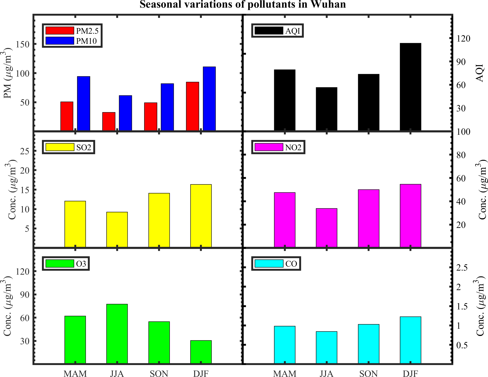
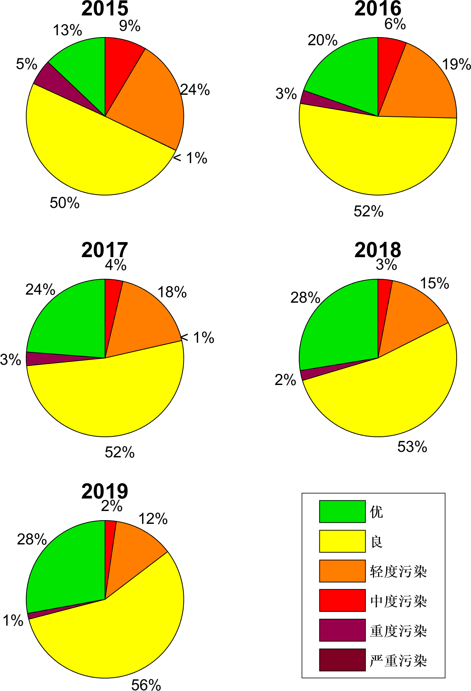

# Wuhan Air Quality Analysis

## Annual AOD Variations 

### Data

MODIS (Terra and Aqua) AOD data from [Giovanni Platform][1], started from 2002 up to 2018-12-31.

### Results

.png)

- Polluted period from 2002 to 2011 can be found with AOD of 0.88±0.05 at 550 nm
- Cleansing period from 2011 up till now with the slope of -0.06±0.01 per year can be found, because of the national-wide strict regulations and governmental control on the local emissions
- Yearly mean AOD of terra is larger than that of Aqua, which may be caused by the diurnal variations of aerosol at 11:00 (local time) for Terra and 13:00 (local time) for Aqua

## Ground-base Station Measurements

### Data

Data used in the analysis was measured by the national ground stations, which put into use since May 2014. The data was collected and released every week by Xiaolei Wang. All the data can be accessed with this [link][2].
The mean results from 9 stations were used to represent the air quality of Wuhan (34.53 N, 114.37 E). The locations of these stations can be found in the map below:

 
<b>station map</b>

The data included 6 pollutants (listed below): 

- PM2.5
- PM10
- SO2
- NO2
- O3
- CO

and the air quality index ([AQI][3])

### Results

#### Diurnal Variations

- The concentration of PM2.5, PM10 and SO2 have the similar diurnal variations, which achieve the minima at 16:00 and increase after 18:00. The minima could be associated with the diurnal trend of mixing layer depth, which arrives the largest between 14:00 and 16:00. The increase after dusk could be explained by the weak atmospheric convection, which will accumulate the pollutants at the surface level.
- The main sources of SO2 is the coal combustion and vehicle exhaust, and the SO2 concentration is controlled by local emissions (positive) and the mixing boundary layer depth (negative), which lead to a diurnal uni-modal distribution. (SO2 has an abrupt increase at 03:00, similar like that of O3 and CO, which could be caused by the nighttime emissions from factories nearby)
- The main sources of NO2 is similar like SO2. Since NO2 can be oxidized by O3, it usually have a opposite relationship as O3.
- O3 emission is usually controlled by the strength of solar radiation, which makes the O3 concentration a similar pattern like the solar elevation angle.
- AQI trend shows the minima at 16:00, which suggest the good time for taking outside exercise.

*Further analysis can be found [here][4]*

#### Seasonal Variations

- PM2.5, PM10, SO2, NO2 and CO all have very clear seasonal variations. PM2.5, PM10, SO2, NO2 and CO have the minimum concentration at summer and the maxima at winter, which is a clear indication of the effects of mixing layer depth. Because the mixing layer depth is the smallest (< 1km) at winter due to the weak latent heat flux and usually over 1.2 km at summer, which provide good convection conditions.
- The difference between PM2.5 and PM10 was the largest at Spring, which could be partly contributed by pollen and transported dust particles.

#### Annual Variations

- PM2.5, PM10 and SO2 continuously decreased since 2015. This can be corroborated by the results of MODIS AOD.

#### AQI Levels

- `No Hazardous` or worse conditions were found in Wuhan since 2015
- The occurrences of `Unhealthy` and `Very Unhealthy` conditions are less than 13% and keep decreasing from 13% (2015) to 3% (2019)
- `Hazardous` condition never happened in 2019. Meanwhile, `Good` and `Moderate` conditions keep increasing from 12% (2015) to 29% (2019) and from 49% (2015) to 57% (2019), respectively.

## Contacts

Zhenping <zp.yin@whu.edu.cn>

[1]: https://giovanni.gsfc.nasa.gov/
[2]: http://beijingair.sinaapp.com/
[3]: https://www.airnow.gov/index.cfm?action=aqibasics.aqi
[4]: https://www.sciencedirect.com/science/article/pii/S0160412015300878